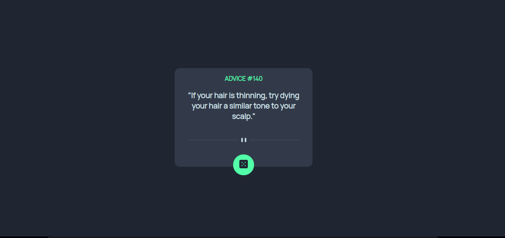

# Frontend Mentor - Advice generator app solution

## Overview

This is a solution to the Advice generator app challenge on Frontend Mentor. This app Advice Slip API to generate random quotes of advice.

### The challenge

Users should be able to:

- View the optimal layout for the app depending on their device's screen size
- See hover states for all interactive elements on the page
- Generate a new piece of advice by clicking the dice icon

### Built with

- [React](https://reactjs.org/) - JS library
- CSS custom properties
- Flexbox
